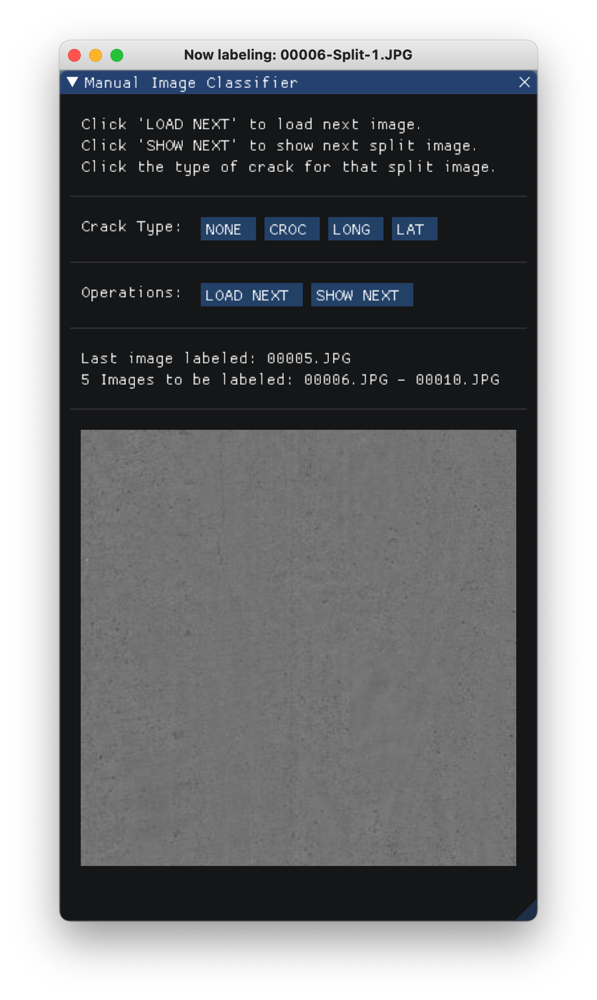
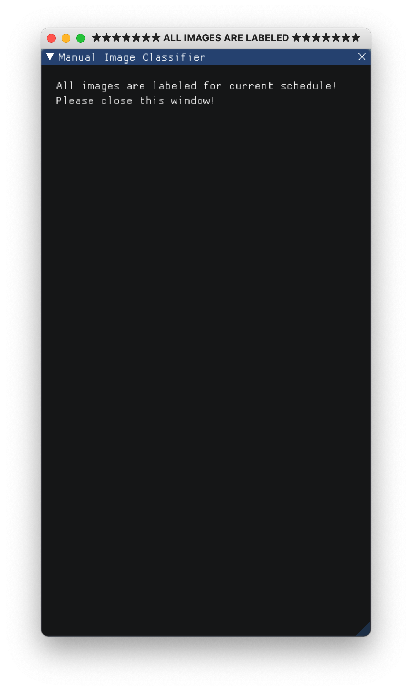

# Manual Classification GUI Guide

This app aims to improve the efficiency for manual crack labelling.

## Which app to use?

`app-bi.py` is for binary classfication: `cracked` and `none`.

`app.py` is for multiple classfication: `long`, `lat`, `croc`, `diag`, `rail` and `none`. 

Although the following user guide will only explain how to use `app.py`, it is essentially the same for `app-bi.py`.

## How to run?

**1.** Firstly, make sure your Python 3 environment has installed `dearpygui`, `pillow` and `numpy`.

If not, you can install by using `pip` (Example command for Mac OS).

```shell
sudo pip install dearpygui
sudo pip install pillow
sudo pip install numpy
```

**2.** Then, create a new folder and move all images that need to be labeled to that folder. For example, move all images to `/Users/root/Desktop/cracks`.

**3.** Then, run in terminal using the following command.

```shell
<your-python3-interpretor-path> <path-to-app.py> <full-path-to-image-folder> <number-of-cracks>
```

For example,

```shell
cd "Classification GUI" 
python3 app.py /Users/root/Desktop/cracks 30
```

**4.** The parameter `<number-of-cracks>` defines how many cracks to label for current schedule. Suppose there are 100 images in total in `/Users/root/Desktop/cracks`, and you wish to label all images within 3 times (e.g.,  30, 30, 40 images for each schedule), you just need to run the following command .

```
# Schedule 1
python3 app.py /Users/root/Desktop/cracks 30
# Schedule 2
python3 app.py /Users/root/Desktop/cracks 30
# Schedule 3
python3 app.py /Users/root/Desktop/cracks 40
```

## How it works?

**1.** The app will save all labels in a `csv` file with name `labels.csv` in sub-folder `save`. The `csv` file has the following format.

 ```txt
 image_name,crack_1,crack_2,crack_3
 00001.JPG,long,lat,none
 00002.JPG,long,long,croc
 00003.JPG,long,lat,croc
 ...
 ```

**2.** Each time you run this app, the system will load this `csv` file and determine from which image to start labelling. Don't worry if your input `<number-of-cracks>` is more than the unlabelled images in the folder, the system will handle it. For example, for 100 images in the labels, it is perfectly fine to run the following command.

```
# Schedule 1
python3 app.py /Users/root/Desktop/cracks 30
# Schedule 2
python3 app.py /Users/root/Desktop/cracks 30
# Schedule 3
python3 app.py /Users/root/Desktop/cracks 50
```

**3.** In the app, you have 3 operation choices.

> **a.** `LOAD NEXT`: To load the image in the system, the system will split the image into 3 smaller images.
>
> **b**. `SHOW NEXT`: To show the next smaller image. For every split image, you need to manually click this button to show it. When all the 3 smaller images haven been shown, you need to click `LOAD NEXT` to load next image.
>
> **c.** Select crack type. You have to select one of the six types: `LONG`, `LAT`, `CROC`, `DIAG`, `RAIL`, `NONE`. Each split image need to be classified at least once. If you clicked multiple types, only the last choice will be saved.

The image of this panel is shown below. 



## What if I jumped over one image?

**1.** Don't worry, the system will not allow you to do so. You will have to label one image before showing the next split image and you will have to label all 3 smaller images before loading the next image. All operations violating the rules will be prevented by the system.

**2.** The window title will also give you some tips for what you should do next and will show your current operation. (It is indeed annoying and will you might get dizzy when labelling hundreds of images)

## What if I mis-labeled one image?

If you haven't clicked `SHOW NEXT`, you can click the crack type button any times you want. Only the last choice of click will be saved.

If you have already clicked `SHOW NEXT`, unfortunately, you can't go back and re-label. However, you have two choices:

> **1. (Recommened)** Close the app and restart. The app will continue from the latest un-labeled imaged.
>
> **2.** Remember on which image you made a mis-labelling. Then, you can open the `labels.csv` file **after you current schedule** and re-label it.

## What if the app crashed during the labelling process?

The system will save the result only when a complete line is buffered (i.e. All 3 split images are lebaled). If app crashed during the labelling process, just restart the app. The app will continue from the latest un-labeled imaged.

## How can I know if all images are lebeled in current schedule?

If you finished labelling all of the images in the current schedule. Then panel will become as the following after clicking `LOAD NEXT`:


